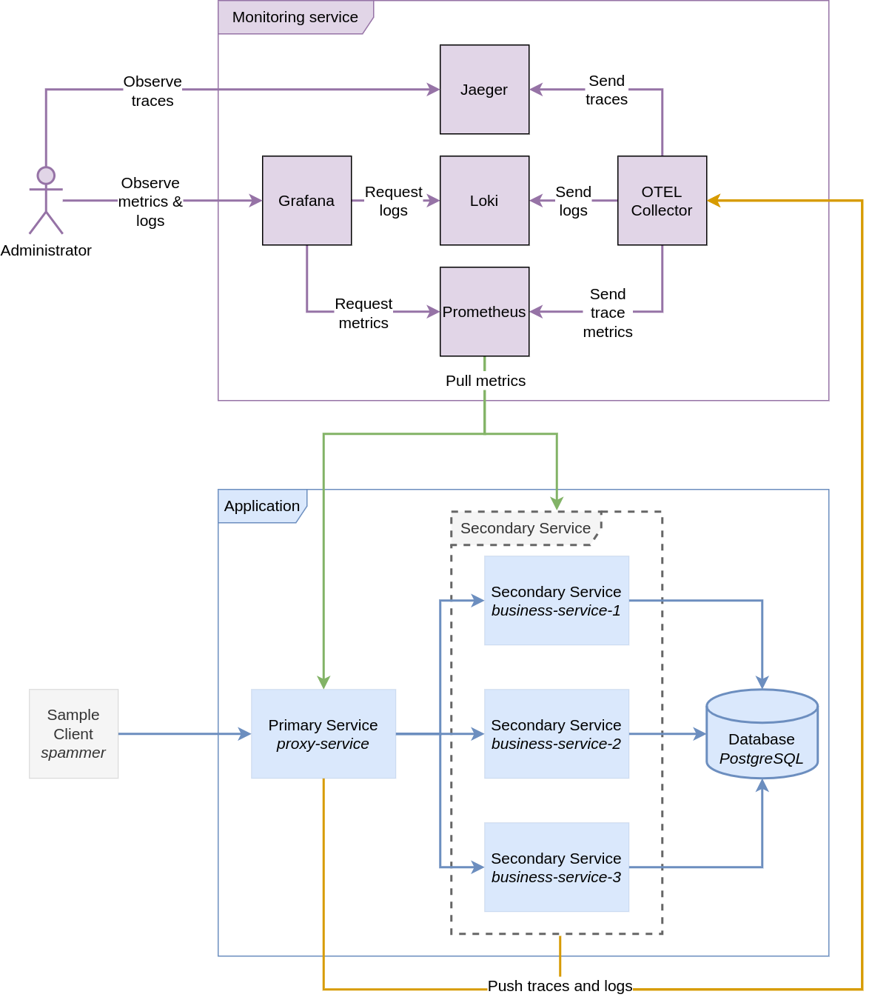
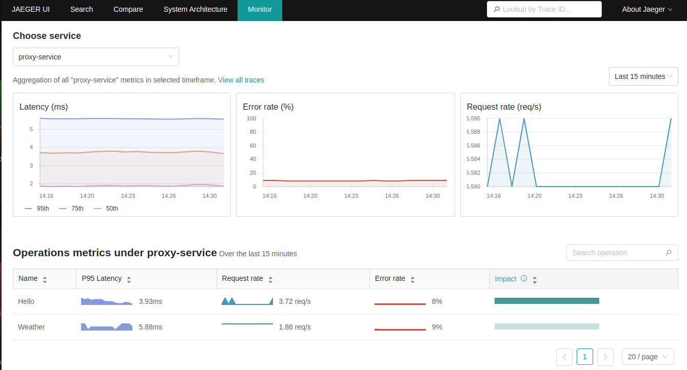
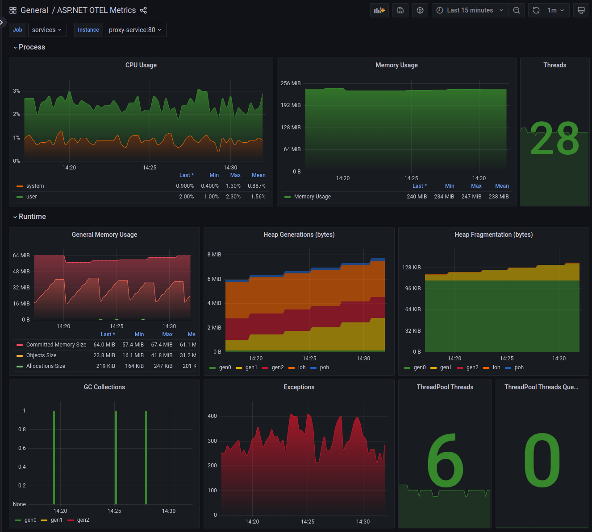
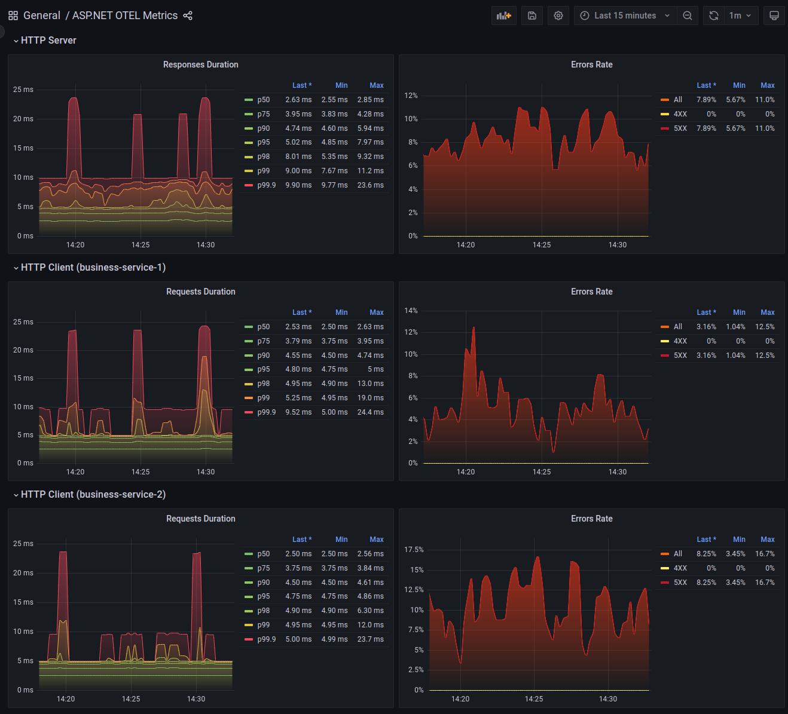

# Sample ASP.NET (.NET 7) project with OpenTelemetry integration

## OpenTelemetry

OpenTelemetry is a collection of tools, APIs, and SDKs to instrument, generate, collect, and export telemetry data (metrics, logs, and traces) to help you analyze your software’s performance and behavior.

Links:
* https://opentelemetry.io/
* https://opentelemetry.io/docs/

There is .NET SDK which helps to integrate .NET application with OpenTelemetry:
* https://opentelemetry.io/docs/instrumentation/net/getting-started/
* https://github.com/open-telemetry/opentelemetry-dotnet
* https://www.nuget.org/packages/OpenTelemetry/

## Goal

The goal of this project is play around with exporting .NET service metrics to [Prometheus](https://prometheus.io/) and tracing service to service communication with [Jaeger](https://www.jaegertracing.io/) using OpenTelementry .NET SDK.

## Components diagram

[Open in app.diagrams.net](https://viewer.diagrams.net/?url=https://raw.githubusercontent.com/nazarii-piontko/sample-dotnet-otel/main/Diagram.xml)

## Implementation details

Two .NET services have been implemented:

The first one is `SampleDotNetOTEL.BusinessService`. It exposes 3 endpoints:
* Get fake auto-generated weather records from the database (PostgreSQL).
* Get `"Hello World"` string
* Get `"Hello {USER_NAME}"` string for passed username parament.

Also `SampleDotNetOTEL.BusinessService` has injected "faults" to simulate service errors.

The second one is `SampleDotNetOTEL.ProxyService`. It exposes the same 3 endpoints as the first service but it just make a HTTP requests `SampleDotNetOTEL.BusinessService` and forward the response as it is.

All services coulld be run with `docker-compose`.

`docker-compose.yml` contains as one of the services a dummy client called `spammer` which makes a requests to 3 endpoints every half a second.

## How to run locally

* Ensure you have `Docker` installed and running.
* Ensure you have `docker-compose` installed.
* Run `docker-compose build`
* Run `docker-compose up`
* As soon as `docker-compose` start services they should be available via HTTP. Here is some links:
  * Grafana pre-build dashboard should be accessible via http://localhost:3000/d/KdDACDp4z/asp-net-otel-metrics
  * Jaeger should be accessible via http://localhost:16686/search
  * Proxy service should be accessible via http://localhost:8080/hello

## Screenshots

### Jaeger

#### Jaeger trace

#### Jaeger monitor

### Grafana

Dashboard: https://grafana.com/grafana/dashboards/17706-asp-net-otel-metrics

